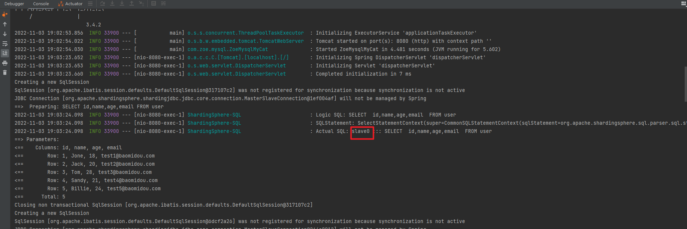
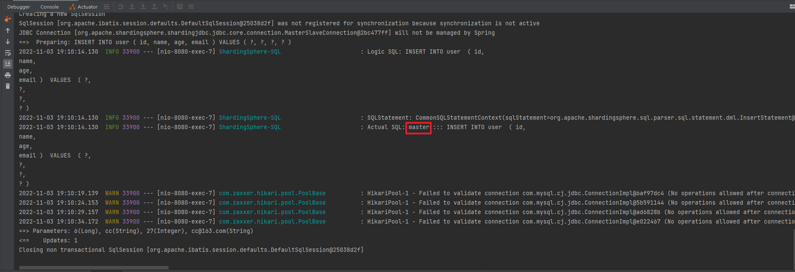

# sharding-jdbc

https://shardingsphere.apache.org/document/4.1.1/cn/overview/

## springboot+sharding-jdbc+HikariCP+mybatis plus做读写分离

1. 添加依赖

```xml
<!-- https://mvnrepository.com/artifact/org.apache.shardingsphere/sharding-jdbc-spring-boot-starter -->
<dependency>
    <groupId>org.apache.shardingsphere</groupId>
    <artifactId>sharding-jdbc-spring-boot-starter</artifactId>
    <version>4.1.1</version>
</dependency>
```


2. 添加数据源配置

```properties
# 这里我们有一主一从
spring.shardingsphere.datasource.names=master,slave0

# 主库的配置
spring.shardingsphere.datasource.master.type=com.zaxxer.hikari.HikariDataSource
spring.shardingsphere.datasource.master.driver-class-name=com.mysql.cj.jdbc.Driver
spring.shardingsphere.datasource.master.jdbcUrl=jdbc:mysql://xxx.xxx.xxx.xxx:3306/zoe?serverTimezone=UTC&characterEncoding=utf-8
spring.shardingsphere.datasource.master.username=root
spring.shardingsphere.datasource.master.password=

# 从库的配置
spring.shardingsphere.datasource.slave0.type=com.zaxxer.hikari.HikariDataSource
spring.shardingsphere.datasource.slave0.driver-class-name=com.mysql.cj.jdbc.Driver
spring.shardingsphere.datasource.slave0.jdbcUrl=jdbc:mysql://xxx.xxx.xxx.xxx2:3306/zoe?serverTimezone=UTC&characterEncoding=utf-8
spring.shardingsphere.datasource.slave0.username=root
spring.shardingsphere.datasource.slave0.password=

# sharding-jdbc本身的一些配置
spring.shardingsphere.masterslave.name=ms
spring.shardingsphere.masterslave.master-data-source-name=master
spring.shardingsphere.masterslave.slave-data-source-names=slave0

spring.shardingsphere.props.sql.show=true

# 无需再添加spring.datasource.*配置
```


3. 启动类启动，初始化2个HikariPool

```txt
Connected to the target VM, address: '127.0.0.1:53388', transport: 'socket'

  .   ____          _            __ _ _
 /\\ / ___'_ __ _ _(_)_ __  __ _ \ \ \ \
( ( )\___ | '_ | '_| | '_ \/ _` | \ \ \ \
 \\/  ___)| |_)| | | | | || (_| |  ) ) ) )
  '  |____| .__|_| |_|_| |_\__, | / / / /
 =========|_|==============|___/=/_/_/_/
 :: Spring Boot ::        (v2.3.7.RELEASE)

2022-11-03 20:35:07.523  INFO 41148 --- [           main] com.zoe.mysql.ZoeMysqlMyCat              : Starting ZoeMysqlMyCat on DESKTOP-K50226G with PID 41148 (D:\Program\study\zoe-mysql-cluster\zoe-mysql-mycat\target\classes started by 80604 in D:\Program\study\zoe-mysql-cluster)
2022-11-03 20:35:07.526  INFO 41148 --- [           main] com.zoe.mysql.ZoeMysqlMyCat              : No active profile set, falling back to default profiles: default
2022-11-03 20:35:08.249  INFO 41148 --- [           main] trationDelegate$BeanPostProcessorChecker : Bean 'stringToNoneShardingStrategyConfigurationConverter' of type [org.apache.shardingsphere.spring.boot.converter.StringToNoneShardingStrategyConfigurationConverter] is not eligible for getting processed by all BeanPostProcessors (for example: not eligible for auto-proxying)
2022-11-03 20:35:08.261  INFO 41148 --- [           main] trationDelegate$BeanPostProcessorChecker : Bean 'spring.shardingsphere.sharding-org.apache.shardingsphere.shardingjdbc.spring.boot.sharding.SpringBootShardingRuleConfigurationProperties' of type [org.apache.shardingsphere.shardingjdbc.spring.boot.sharding.SpringBootShardingRuleConfigurationProperties] is not eligible for getting processed by all BeanPostProcessors (for example: not eligible for auto-proxying)
2022-11-03 20:35:08.266  INFO 41148 --- [           main] trationDelegate$BeanPostProcessorChecker : Bean 'spring.shardingsphere.masterslave-org.apache.shardingsphere.shardingjdbc.spring.boot.masterslave.SpringBootMasterSlaveRuleConfigurationProperties' of type [org.apache.shardingsphere.shardingjdbc.spring.boot.masterslave.SpringBootMasterSlaveRuleConfigurationProperties] is not eligible for getting processed by all BeanPostProcessors (for example: not eligible for auto-proxying)
2022-11-03 20:35:08.268  INFO 41148 --- [           main] trationDelegate$BeanPostProcessorChecker : Bean 'spring.shardingsphere.encrypt-org.apache.shardingsphere.shardingjdbc.spring.boot.encrypt.SpringBootEncryptRuleConfigurationProperties' of type [org.apache.shardingsphere.shardingjdbc.spring.boot.encrypt.SpringBootEncryptRuleConfigurationProperties] is not eligible for getting processed by all BeanPostProcessors (for example: not eligible for auto-proxying)
2022-11-03 20:35:08.271  INFO 41148 --- [           main] trationDelegate$BeanPostProcessorChecker : Bean 'spring.shardingsphere.shadow-org.apache.shardingsphere.shardingjdbc.spring.boot.shadow.SpringBootShadowRuleConfigurationProperties' of type [org.apache.shardingsphere.shardingjdbc.spring.boot.shadow.SpringBootShadowRuleConfigurationProperties] is not eligible for getting processed by all BeanPostProcessors (for example: not eligible for auto-proxying)
2022-11-03 20:35:08.273  INFO 41148 --- [           main] trationDelegate$BeanPostProcessorChecker : Bean 'spring.shardingsphere-org.apache.shardingsphere.shardingjdbc.spring.boot.common.SpringBootPropertiesConfigurationProperties' of type [org.apache.shardingsphere.shardingjdbc.spring.boot.common.SpringBootPropertiesConfigurationProperties] is not eligible for getting processed by all BeanPostProcessors (for example: not eligible for auto-proxying)
2022-11-03 20:35:08.398  INFO 41148 --- [           main] trationDelegate$BeanPostProcessorChecker : Bean 'org.apache.shardingsphere.shardingjdbc.spring.boot.SpringBootConfiguration' of type [org.apache.shardingsphere.shardingjdbc.spring.boot.SpringBootConfiguration$$EnhancerBySpringCGLIB$$1d14eb44] is not eligible for getting processed by all BeanPostProcessors (for example: not eligible for auto-proxying)
2022-11-03 20:35:08.626  INFO 41148 --- [           main] o.s.b.w.embedded.tomcat.TomcatWebServer  : Tomcat initialized with port(s): 8080 (http)
2022-11-03 20:35:08.633  INFO 41148 --- [           main] o.apache.catalina.core.StandardService   : Starting service [Tomcat]
2022-11-03 20:35:08.633  INFO 41148 --- [           main] org.apache.catalina.core.StandardEngine  : Starting Servlet engine: [Apache Tomcat/9.0.41]
2022-11-03 20:35:08.709  INFO 41148 --- [           main] o.a.c.c.C.[Tomcat].[localhost].[/]       : Initializing Spring embedded WebApplicationContext
2022-11-03 20:35:08.709  INFO 41148 --- [           main] w.s.c.ServletWebServerApplicationContext : Root WebApplicationContext: initialization completed in 995 ms
Logging initialized using 'class org.apache.ibatis.logging.stdout.StdOutImpl' adapter.
2022-11-03 20:35:08.838  INFO 41148 --- [           main] com.zaxxer.hikari.HikariDataSource       : HikariPool-1 - Starting...
2022-11-03 20:35:10.956  INFO 41148 --- [           main] com.zaxxer.hikari.HikariDataSource       : HikariPool-1 - Start completed.
2022-11-03 20:35:10.966  INFO 41148 --- [           main] com.zaxxer.hikari.HikariDataSource       : HikariPool-2 - Starting...
2022-11-03 20:35:11.200  INFO 41148 --- [           main] com.zaxxer.hikari.HikariDataSource       : HikariPool-2 - Start completed.
2022-11-03 20:35:11.243  INFO 41148 --- [           main] o.a.s.core.log.ConfigurationLogger       : MasterSlaveRuleConfiguration:
masterDataSourceName: master
name: ms
slaveDataSourceNames:
- slave0

2022-11-03 20:35:11.243  INFO 41148 --- [           main] o.a.s.core.log.ConfigurationLogger       : Properties:
sql.show: 'true'

2022-11-03 20:35:11.297  INFO 41148 --- [           main] ShardingSphere-metadata                  : Loading 1 tables' meta data.
2022-11-03 20:35:11.383  INFO 41148 --- [           main] ShardingSphere-metadata                  : Meta data load finished, cost 140 milliseconds.
Property 'mapperLocations' was not specified.
 _ _   |_  _ _|_. ___ _ |    _ 
| | |\/|_)(_| | |_\  |_)||_|_\ 
     /               |         
                        3.4.2 
2022-11-03 20:35:12.347  INFO 41148 --- [           main] o.s.s.concurrent.ThreadPoolTaskExecutor  : Initializing ExecutorService 'applicationTaskExecutor'
2022-11-03 20:35:12.610  INFO 41148 --- [           main] o.s.b.w.embedded.tomcat.TomcatWebServer  : Tomcat started on port(s): 8080 (http) with context path ''
2022-11-03 20:35:12.620  INFO 41148 --- [           main] com.zoe.mysql.ZoeMysqlMyCat              : Started ZoeMysqlMyCat in 5.507 seconds (JVM running for 7.219)

```


4. 数据库主从配置（基于GTID的主从复制）

    - 主从服务安装MySQL

    - 主服务

        - 修改my.cnf文件，并重启服务`systemctl restart mysqld;`

          ```shell
          # 服务器ID
          server-id=132
          # 启动二进制文件
          log-bin=mysql-bin
          # 开启gtid
          gtid_mode=on
          enforce_gtid_consistency=on
          # 强烈建议，其他格式可能造成数据不一致
          binlog_format=row
          ```

        - 主机给从机授备份权限

          ```shell
          ## 提示不符合密码策略要求，set global validate_password_policy=0;不建议
          GRANT REPLICATION SLAVE ON *.* TO 'root'@'%' identified by 'xxx';
          ```

        - `FLUSH PRIVILEGES;`

        - `show master status;`

          ```shell
          mysql> show master status;
          +------------------+----------+--------------+------------------+------------------------------------------+
          | File             | Position | Binlog_Do_DB | Binlog_Ignore_DB | Executed_Gtid_Set                        |
          +------------------+----------+--------------+------------------+------------------------------------------+
          | mysql-bin.000002 |      194 |              |                  | cbe30797-5b5c-11ed-8c68-fa163e9af144:1-7 |
          +------------------+----------+--------------+------------------+------------------------------------------+
          1 row in set (0.00 sec)
          
          ```


- 从服务

    - 修改my.cnf文件，并重启服务`systemctl restart mysqld;`

      ```shell
      # 服务器ID
      server-id=134
      # 开启gtid
      gtid_mode=on
      enforce_gtid_consistency=on
      # 做级联复制的时候，再开启。允许下端接入slave
      log_slave_updates=1
      ```

    - 指定master，启动从节点`start slave;`

      ```shell
      # 切换主节点配置，比基于pos简单不少
      change master to
      master_host='xxx.xxx.xxx.xxx',
      master_port=3306,
      master_user='root',
      master_password='xxx',
      master_auto_position=1;
      ```

    - `show slave status\G;`Slave_IO_Running/Slave_SQL_Running都为YES，说明主从复制配置成功

      ```shell
      mysql>  show slave status\G;
      *************************** 1. row ***************************
                     Slave_IO_State: Waiting for master to send event
                        Master_Host: xxx.xxx.xxx.xx
                        Master_User: root
                        Master_Port: 3306
                      Connect_Retry: 60
                    Master_Log_File: mysql-bin.000002
                Read_Master_Log_Pos: 194
                     Relay_Log_File: ecs-d78d-relay-bin.000004
                      Relay_Log_Pos: 407
              Relay_Master_Log_File: mysql-bin.000002
                   Slave_IO_Running: Yes
                  Slave_SQL_Running: Yes
                    Replicate_Do_DB: 
                Replicate_Ignore_DB: 
                 Replicate_Do_Table: 
             Replicate_Ignore_Table: 
            Replicate_Wild_Do_Table: 
        Replicate_Wild_Ignore_Table: 
                         Last_Errno: 0
                         Last_Error: 
                       Skip_Counter: 0
                Exec_Master_Log_Pos: 194
                    Relay_Log_Space: 657
                    Until_Condition: None
                     Until_Log_File: 
                      Until_Log_Pos: 0
                 Master_SSL_Allowed: No
                 Master_SSL_CA_File: 
                 Master_SSL_CA_Path: 
                    Master_SSL_Cert: 
                  Master_SSL_Cipher: 
                     Master_SSL_Key: 
              Seconds_Behind_Master: 0
      Master_SSL_Verify_Server_Cert: No
                      Last_IO_Errno: 0
                      Last_IO_Error: 
                     Last_SQL_Errno: 0
                     Last_SQL_Error: 
        Replicate_Ignore_Server_Ids: 
                   Master_Server_Id: 132
                        Master_UUID: cbe30797-5b5c-11ed-8c68-fa163e9af144
                   Master_Info_File: /var/lib/mysql/master.info
                          SQL_Delay: 0
                SQL_Remaining_Delay: NULL
            Slave_SQL_Running_State: Slave has read all relay log; waiting for more updates
                 Master_Retry_Count: 86400
                        Master_Bind: 
            Last_IO_Error_Timestamp: 
           Last_SQL_Error_Timestamp: 
                     Master_SSL_Crl: 
                 Master_SSL_Crlpath: 
                 Retrieved_Gtid_Set: cbe30797-5b5c-11ed-8c68-fa163e9af144:1-7
                  Executed_Gtid_Set: cbe30797-5b5c-11ed-8c68-fa163e9af144:1-7
                      Auto_Position: 1
               Replicate_Rewrite_DB: 
                       Channel_Name: 
                 Master_TLS_Version: 
      1 row in set (0.00 sec)
      
      ```


5. 测试

    - 访问http://localhost:8080/user/findAll，返回用户列表，访问slave

      

    - 访问http://localhost:8080/user/addUser，并添加Body`{"id":6,"name":"cc","age":27,"email":"cc@163.com"}`，返回1，访问master

      


# MyCat

1. 配置mycat数据源（即server.xml中配置的端口、用户名、密码）

```yaml
spring:
  datasource:
    driver-class-name: com.mysql.cj.jdbc.Driver
    url: jdbc:mysql://xxx.xxx.xxx.xxx:8066/zoe?serverTimezone=UTC&characterEncoding=utf-8
    username: root
    password: 123456
```


2. 启动类启动，只有一个数据源（只初始化一个HikariPool）

```txt
Connected to the target VM, address: '127.0.0.1:58274', transport: 'socket'

  .   ____          _            __ _ _
 /\\ / ___'_ __ _ _(_)_ __  __ _ \ \ \ \
( ( )\___ | '_ | '_| | '_ \/ _` | \ \ \ \
 \\/  ___)| |_)| | | | | || (_| |  ) ) ) )
  '  |____| .__|_| |_|_| |_\__, | / / / /
 =========|_|==============|___/=/_/_/_/
 :: Spring Boot ::        (v2.3.7.RELEASE)

2022-11-03 22:03:01.492  INFO 29568 --- [           main] com.zoe.mysql.ZoeMysqlMyCat              : Starting ZoeMysqlMyCat on DESKTOP-K50226G with PID 29568 (D:\Program\study\zoe-mysql-cluster\zoe-mysql-mycat\target\classes started by 80604 in D:\Program\study\zoe-mysql-cluster)
2022-11-03 22:03:01.496  INFO 29568 --- [           main] com.zoe.mysql.ZoeMysqlMyCat              : No active profile set, falling back to default profiles: default
2022-11-03 22:03:02.298  INFO 29568 --- [           main] o.s.b.w.embedded.tomcat.TomcatWebServer  : Tomcat initialized with port(s): 8080 (http)
2022-11-03 22:03:02.305  INFO 29568 --- [           main] o.apache.catalina.core.StandardService   : Starting service [Tomcat]
2022-11-03 22:03:02.305  INFO 29568 --- [           main] org.apache.catalina.core.StandardEngine  : Starting Servlet engine: [Apache Tomcat/9.0.41]
2022-11-03 22:03:02.374  INFO 29568 --- [           main] o.a.c.c.C.[Tomcat].[localhost].[/]       : Initializing Spring embedded WebApplicationContext
2022-11-03 22:03:02.374  INFO 29568 --- [           main] w.s.c.ServletWebServerApplicationContext : Root WebApplicationContext: initialization completed in 827 ms
Logging initialized using 'class org.apache.ibatis.logging.stdout.StdOutImpl' adapter.
Property 'mapperLocations' was not specified.
 _ _   |_  _ _|_. ___ _ |    _ 
| | |\/|_)(_| | |_\  |_)||_|_\ 
     /               |         
                        3.4.2 
2022-11-03 22:03:03.423  INFO 29568 --- [           main] o.s.s.concurrent.ThreadPoolTaskExecutor  : Initializing ExecutorService 'applicationTaskExecutor'
2022-11-03 22:03:03.579  INFO 29568 --- [           main] o.s.b.w.embedded.tomcat.TomcatWebServer  : Tomcat started on port(s): 8080 (http) with context path ''
2022-11-03 22:03:03.586  INFO 29568 --- [           main] com.zoe.mysql.ZoeMysqlMyCat              : Started ZoeMysqlMyCat in 2.441 seconds (JVM running for 3.464)
2022-11-03 22:03:16.314  INFO 29568 --- [nio-8080-exec-1] o.a.c.c.C.[Tomcat].[localhost].[/]       : Initializing Spring DispatcherServlet 'dispatcherServlet'
2022-11-03 22:03:16.315  INFO 29568 --- [nio-8080-exec-1] o.s.web.servlet.DispatcherServlet        : Initializing Servlet 'dispatcherServlet'
2022-11-03 22:03:16.320  INFO 29568 --- [nio-8080-exec-1] o.s.web.servlet.DispatcherServlet        : Completed initialization in 5 ms
Creating a new SqlSession
SqlSession [org.apache.ibatis.session.defaults.DefaultSqlSession@4eee991] was not registered for synchronization because synchronization is not active
2022-11-03 22:03:16.364  INFO 29568 --- [nio-8080-exec-1] com.zaxxer.hikari.HikariDataSource       : HikariPool-1 - Starting...
2022-11-03 22:03:16.733  INFO 29568 --- [nio-8080-exec-1] com.zaxxer.hikari.HikariDataSource       : HikariPool-1 - Start completed.
JDBC Connection [HikariProxyConnection@1814973919 wrapping com.mysql.cj.jdbc.ConnectionImpl@157e53] will not be managed by Spring
==>  Preparing: SELECT id,name,age,email FROM user
==> Parameters: 
<==    Columns: id, name, age, email
<==        Row: 1, Jone, 18, test1@baomidou.com
<==        Row: 2, Jack, 20, test2@baomidou.com
<==        Row: 3, Tom, 28, test3@baomidou.com
<==        Row: 4, Sandy, 21, test4@baomidou.com
<==        Row: 5, Billie, 24, test5@baomidou.com
<==        Row: 6, cc, 27, cc@163.com
<==      Total: 6
Closing non transactional SqlSession [org.apache.ibatis.session.defaults.DefaultSqlSession@4eee991]
Creating a new SqlSession
SqlSession [org.apache.ibatis.session.defaults.DefaultSqlSession@1b23be80] was not registered for synchronization because synchronization is not active
JDBC Connection [HikariProxyConnection@95046384 wrapping com.mysql.cj.jdbc.ConnectionImpl@157e53] will not be managed by Spring
==>  Preparing: INSERT INTO user ( id, name, age, email ) VALUES ( ?, ?, ?, ? )
==> Parameters: 7(Long), zcc(String), 27(Integer), zcc@163.com(String)
<==    Updates: 1
Closing non transactional SqlSession [org.apache.ibatis.session.defaults.DefaultSqlSession@1b23be80]
Creating a new SqlSession
SqlSession [org.apache.ibatis.session.defaults.DefaultSqlSession@43fe1714] was not registered for synchronization because synchronization is not active
JDBC Connection [HikariProxyConnection@1295642907 wrapping com.mysql.cj.jdbc.ConnectionImpl@157e53] will not be managed by Spring
==>  Preparing: SELECT id,name,age,email FROM user
==> Parameters: 
<==    Columns: id, name, age, email
<==        Row: 1, Jone, 18, test1@baomidou.com
<==        Row: 2, Jack, 20, test2@baomidou.com
<==        Row: 3, Tom, 28, test3@baomidou.com
<==        Row: 4, Sandy, 21, test4@baomidou.com
<==        Row: 5, Billie, 24, test5@baomidou.com
<==        Row: 6, cc, 27, cc@163.com
<==        Row: 7, zcc, 27, zcc@163.com
<==      Total: 7
Closing non transactional SqlSession [org.apache.ibatis.session.defaults.DefaultSqlSession@43fe1714]
Disconnected from the target VM, address: '127.0.0.1:58274', transport: 'socket'
2022-11-03 22:03:37.050  INFO 29568 --- [extShutdownHook] o.s.s.concurrent.ThreadPoolTaskExecutor  : Shutting down ExecutorService 'applicationTaskExecutor'
2022-11-03 22:03:37.050  INFO 29568 --- [extShutdownHook] com.zaxxer.hikari.HikariDataSource       : HikariPool-1 - Shutdown initiated...
2022-11-03 22:03:37.057  INFO 29568 --- [extShutdownHook] com.zaxxer.hikari.HikariDataSource       : HikariPool-1 - Shutdown completed.

Process finished with exit code -1

```

3. mycat配置

    - 下载安装mycat

      ```shell
      ## 保证服务器有jdk，不然启动不了
      wget http://dl.mycat.org.cn/1.6.7.1/Mycat-server-1.6.7.1-release-20190627191042-linux.tar.gz
      tar -zxf Mycat-server-1.6.7.1-release-20190627191042-linux.tar.gz
      ```

    - 配置server.xml

      ```xml
      <system>
          <property name="serverPort">8066</property>
          <property name="managerPort">9066</property> 
      </system>
      
      <user name="root" defaultAccount="true">
          <property name="password">123456</property>
          <property name="schemas">zoe</property>
      </user>
      
      <user name="user">
          <property name="password">user</property>
          <property name="schemas">zoe</property>
          <property name="readOnly">true</property>
      </user>
      
      ```

    - 配置schema.xml

      ```xml
      <mycat:schema xmlns:mycat="http://io.mycat/">
      
          <schema name="zoe" checkSQLschema="true" sqlMaxLimit="100">
              <!-- auto sharding by id (long) -->
              <table name="user" dataNode="dn1"/>
          </schema>
          <!-- <dataNode name="dn1$0-743" dataHost="localhost1" database="db$0-743"
              /> -->
          <dataNode name="dn1" dataHost="localhost1" database="zoe" />
          <!--<dataNode name="dn4" dataHost="sequoiadb1" database="SAMPLE" />
           <dataNode name="jdbc_dn1" dataHost="jdbchost" database="db1" />
          <dataNode	name="jdbc_dn2" dataHost="jdbchost" database="db2" />
          <dataNode name="jdbc_dn3" 	dataHost="jdbchost" database="db3" /> -->
          <dataHost name="localhost1" maxCon="1000" minCon="10" balance="0"
                    writeType="0" dbType="mysql" dbDriver="native" switchType="1"  slaveThreshold="100">
              <heartbeat>select user()</heartbeat>
              <!-- can have multi write hosts -->
              <writeHost host="hostM1" url="xxx.xxx.xxx.xxx:3306" user="root"
                         password="123456">
                  <!-- can have multi read hosts -->
                  <readHost host="hostS2" url="xxx.xxx.xxx.xxx2:3306" user="root" password="123456" />
              </writeHost>
          </dataHost>
      </mycat:schema>
      ```

    - 启动mycat

      ```shell
      /root/mycat/bin/mycat start
      /root/mycat/bin/mycat stop
      /root/mycat/bin/mycat restart
      /root/mycat/bin/mycat status
      ```

    - 安装keepalived

      ```shell
      yum install keepalived -y
      ```

    - 配置keepalived

      ```shell
      ## 查看配置文件
      rpm -qc keepalived
      /etc/keepalived/keepalived.conf
      /etc/sysconfig/keepalived
      ```

        - 修改配置文件

          ```shell
          #检查mysql脚本，定时执行
          vrrp_script check_run {
              script "/usr/local/check_run.sh"
              interval 3
          } #
          设置虚拟ip
          vrrp_instance VI_1 {
              # 当前节点的状态MASTER、BACKUP
              state MASTER
              # 当前服务器使用的网卡名称，使用ifconfig查看
              interface eth0
              #VRRP组名，两个节点的设置必须一样
              virtual_router_id 51
              #Master节点的优先级（1-254之间）
              priority 100
              #组播信息发送间隔，两个节点设置必须一样
              advert_int 1
              #设置验证信息，两个节点必须一致
              authentication {
                  auth_type PASS
                  auth_pass 1111
              }
              #虚拟IP,对外提供MySQL服务的IP地址
              virtual_ipaddress {
                  172.26.233.206
              }
          }
          ```

        - 新增启动脚本

          ```shell
          #!/bin/bash
          . /root/.bashrc
          count=1
          while true
          do
          mysql -uroot -pitxiongge@1 -S /var/lib/mysql/mysql.sock -e "select now();" >
          /dev/null 2>&1
          i=$?
          ps aux | grep mysqld | grep -v grep > /dev/null 2>&1
          j=$?
          if [ $i = 0 ] && [ $j = 0 ]
          then
              exit 0
          else
              if [ $i = 1 ] && [ $j = 0 ]
              then
                  exit 0
              else
                  if [ $count -gt 5 ]
                  then
                      break
                  fi
              let count++
              continue
              fi
          fi
          done
          systemctl stop keepalived.service
          ```

        - 启动keepalived

          ```shell
          systemctl start keepalived
          
          ##查看ip
          [root@hero03 ~]# ip addr
          1: lo: <LOOPBACK,UP,LOWER_UP> mtu 65536 qdisc noqueue state UNKNOWN group
          default qlen 1000
              link/loopback 00:00:00:00:00:00 brd 00:00:00:00:00:00
              inet 127.0.0.1/8 scope host lo
                  valid_lft forever preferred_lft forever
          2: eth0: <BROADCAST,MULTICAST,UP,LOWER_UP> mtu 1500 qdisc mq state UP group
          default qlen 1000
              link/ether 00:16:3e:0b:0f:0a brd ff:ff:ff:ff:ff:ff
              inet 172.26.233.197/20 brd 172.26.239.255 scope global dynamic eth0
                  valid_lft 301467836sec preferred_lft 301467836sec
              inet 172.26.233.110/32 scope global eth0
                  valid_lft forever preferred_lft forever
          ```
   
       